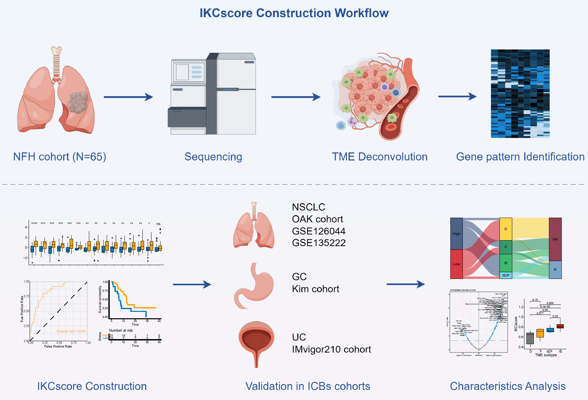
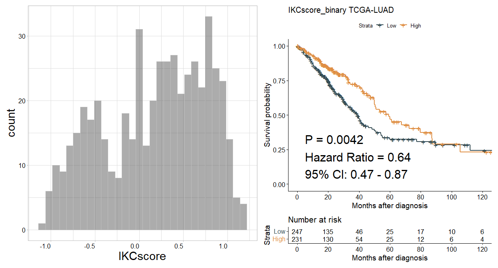

<!-- README.md is generated from README.Rmd. Please edit that file -->

# IKCscore

IKCscore is an R package to predict the treatment response of
immunotherapy in patients with NSCLC.

## 1.Introduction

1.IKCscore was designed to predict the response to immunotherapy in
patients with NSCLC. 2.This package consists a IKC model based on
expression profiles of 41 gene, which were selected through gene
expression pattern. 3.This package provides functions for different
scenarios and allows visual assessment to determine whether patients are
suitable for immunotherapy.

## 2.Installation

It is essential that you have R 3.6.3 or above already installed on your
computer or server. Before installing IKCscore, please install all
dependencies by executing the following command in R console:

The dependencies includes`IOBR`,`crayon`,`ggplot2`.

#### Graphical abstract for construction and clinical application of IKCscore

<figure>

<figcaption aria-hidden="true">IKCscore logo</figcaption>
</figure>

``` r
if (!requireNamespace("BiocManager", quietly = TRUE)) install.packages("BiocManager")
depens<-c( "crayon", "ggplot2")
for(i in 1:length(depens)){
  depen<-depens[i]
  if (!requireNamespace(depen, quietly = TRUE))   BiocManager::install(depen,update = FALSE)
}
if (!requireNamespace("IOBR", quietly = TRUE))  devtools::install_github("IOBR/IOBR")
```

Then, you can start to install IOBR from github by typing the following
code into your R session:

``` r
if (!requireNamespace("IKCscore", quietly = TRUE))
  remotes::install_github("LiaoWJLab/IKCscore")
```

Load the IOBR package in your R session after the installation is
complete:

``` r
library(IKCscore)
library(IOBR)
library(tidyverse)
```

## 3.Usage

### Obtain dataset from TCGA using UCSCXenaTools R package.

For transcriptome data of TCGA data sets, we strongly recommend user to
use UCSCXenaTools R package. Here, we download counts data of TCGA-LUAD
from UCSC using UCSCXenaTools R package

``` r
if (!requireNamespace("UCSCXenaTools", quietly = TRUE))
    BiocManager::install("UCSCXenaTools")
library(UCSCXenaTools)

eset<-XenaGenerate(subset = XenaCohorts =="GDC TCGA Lung Adenocarcinoma (LUAD)") %>%
  XenaFilter(filterDatasets    = "TCGA-LUAD.htseq_counts.tsv") %>%
  XenaQuery() %>%
  XenaDownload() %>%
  XenaPrepare()
```

``` r
eset<- readr::read_tsv("TCGA-LUAD.htseq_counts.tsv.gz")
# Remove the version numbers in Ensembl ID.
eset$Ensembl_ID<-substring(eset$Ensembl_ID, 1, 15)
eset<-column_to_rownames(eset, var = "Ensembl_ID")
# Revert back to original format because the data from UCSC was log2(x+1)transformed.
eset<-(2^eset)-1
head(eset[1:5,1:5])
#>                 TCGA-97-7938-01A TCGA-55-7574-01A TCGA-05-4250-01A
#> ENSG00000000003             2032             1000             5355
#> ENSG00000000005               15                0                5
#> ENSG00000000419             1220              744             2898
#> ENSG00000000457              876              560              734
#> ENSG00000000460              250              325              785
#>                 TCGA-55-6979-11A TCGA-95-A4VK-01A
#> ENSG00000000003              516             2269
#> ENSG00000000005                0                1
#> ENSG00000000419              589              819
#> ENSG00000000457              361             1477
#> ENSG00000000460               88              327

#remove normal sample of TCGA-LUAD
eset<- eset[,!substring(colnames(eset), 14,16)=="11A"]
colnames(eset)<- substring(colnames(eset), 1,12)
summary(duplicated(colnames(eset)))
#>    Mode   FALSE    TRUE 
#> logical     513      14
eset<- eset[,!duplicated(colnames(eset))]
```

### Transform count data to TPM using [IOBR package](https://iobr.github.io/book/).

``` r
eset_tpm <- count2tpm(countMat = eset, idType = "Ensembl")
#> >>>--- Using variables (anno_grch38) and gene lengths (eff_length)  built into the IOBR package to perform TPM transformation
#> >>>--- The gene lengths (eff_length) was estimated by function `getGeneLengthAndGCContent` from EDASeq package with default parameters at 2023-02-10
#> Warning in count2tpm(countMat = eset, idType = "Ensembl"): >>>--- Omit 3985
#> genes of which length is not available !
#using phenotype data derived from TCGA paper [https://pubmed.ncbi.nlm.nih.gov/34019806/]
data(pdata_luad)
summary(pdata_luad$ID%in%colnames(eset))
#>    Mode   FALSE    TRUE 
#> logical       3     495
```

### Annotating genes in expression matrix and remove duplicate genes using [IOBR package](https://iobr.github.io/book/).

``` r
eset <- anno_eset(eset = eset, annotation = anno_grch38, probe = "id", symbol = "symbol")
#> Row number of original eset:
#> >>>>  60488
#> >>> 99.73% of probe in expression set was annotated
#> Row number after filtering duplicated gene symbol:
#> >>>>  56011
```

## Calculate IKCscore score of TCGA-LUAD samples

``` r
res <-  ikc_score(eset = eset_luad, pdata = pdata_luad, scale = TRUE)
#> >>>-- Scaling data...
#> >>>-- Predicting new data with IKC model...
#> Estimating ssGSEA scores for 3 gene sets.
#> [1] "Calculating ranks..."
#> [1] "Calculating absolute values from ranks..."
#>   |                                                                              |                                                                      |   0%  |                                                                              |                                                                      |   1%  |                                                                              |=                                                                     |   1%  |                                                                              |=                                                                     |   2%  |                                                                              |==                                                                    |   2%  |                                                                              |==                                                                    |   3%  |                                                                              |==                                                                    |   4%  |                                                                              |===                                                                   |   4%  |                                                                              |===                                                                   |   5%  |                                                                              |====                                                                  |   5%  |                                                                              |====                                                                  |   6%  |                                                                              |=====                                                                 |   6%  |                                                                              |=====                                                                 |   7%  |                                                                              |=====                                                                 |   8%  |                                                                              |======                                                                |   8%  |                                                                              |======                                                                |   9%  |                                                                              |=======                                                               |   9%  |                                                                              |=======                                                               |  10%  |                                                                              |=======                                                               |  11%  |                                                                              |========                                                              |  11%  |                                                                              |========                                                              |  12%  |                                                                              |=========                                                             |  12%  |                                                                              |=========                                                             |  13%  |                                                                              |==========                                                            |  14%  |                                                                              |==========                                                            |  15%  |                                                                              |===========                                                           |  15%  |                                                                              |===========                                                           |  16%  |                                                                              |============                                                          |  17%  |                                                                              |============                                                          |  18%  |                                                                              |=============                                                         |  18%  |                                                                              |=============                                                         |  19%  |                                                                              |==============                                                        |  19%  |                                                                              |==============                                                        |  20%  |                                                                              |==============                                                        |  21%  |                                                                              |===============                                                       |  21%  |                                                                              |===============                                                       |  22%  |                                                                              |================                                                      |  22%  |                                                                              |================                                                      |  23%  |                                                                              |=================                                                     |  24%  |                                                                              |=================                                                     |  25%  |                                                                              |==================                                                    |  25%  |                                                                              |==================                                                    |  26%  |                                                                              |===================                                                   |  27%  |                                                                              |===================                                                   |  28%  |                                                                              |====================                                                  |  28%  |                                                                              |====================                                                  |  29%  |                                                                              |=====================                                                 |  29%  |                                                                              |=====================                                                 |  30%  |                                                                              |=====================                                                 |  31%  |                                                                              |======================                                                |  31%  |                                                                              |======================                                                |  32%  |                                                                              |=======================                                               |  32%  |                                                                              |=======================                                               |  33%  |                                                                              |=======================                                               |  34%  |                                                                              |========================                                              |  34%  |                                                                              |========================                                              |  35%  |                                                                              |=========================                                             |  35%  |                                                                              |=========================                                             |  36%  |                                                                              |==========================                                            |  36%  |                                                                              |==========================                                            |  37%  |                                                                              |==========================                                            |  38%  |                                                                              |===========================                                           |  38%  |                                                                              |===========================                                           |  39%  |                                                                              |============================                                          |  39%  |                                                                              |============================                                          |  40%  |                                                                              |============================                                          |  41%  |                                                                              |=============================                                         |  41%  |                                                                              |=============================                                         |  42%  |                                                                              |==============================                                        |  42%  |                                                                              |==============================                                        |  43%  |                                                                              |===============================                                       |  44%  |                                                                              |===============================                                       |  45%  |                                                                              |================================                                      |  45%  |                                                                              |================================                                      |  46%  |                                                                              |=================================                                     |  47%  |                                                                              |=================================                                     |  48%  |                                                                              |==================================                                    |  48%  |                                                                              |==================================                                    |  49%  |                                                                              |===================================                                   |  49%  |                                                                              |===================================                                   |  50%  |                                                                              |===================================                                   |  51%  |                                                                              |====================================                                  |  51%  |                                                                              |====================================                                  |  52%  |                                                                              |=====================================                                 |  52%  |                                                                              |=====================================                                 |  53%  |                                                                              |======================================                                |  54%  |                                                                              |======================================                                |  55%  |                                                                              |=======================================                               |  55%  |                                                                              |=======================================                               |  56%  |                                                                              |========================================                              |  57%  |                                                                              |========================================                              |  58%  |                                                                              |=========================================                             |  58%  |                                                                              |=========================================                             |  59%  |                                                                              |==========================================                            |  59%  |                                                                              |==========================================                            |  60%  |                                                                              |==========================================                            |  61%  |                                                                              |===========================================                           |  61%  |                                                                              |===========================================                           |  62%  |                                                                              |============================================                          |  62%  |                                                                              |============================================                          |  63%  |                                                                              |============================================                          |  64%  |                                                                              |=============================================                         |  64%  |                                                                              |=============================================                         |  65%  |                                                                              |==============================================                        |  65%  |                                                                              |==============================================                        |  66%  |                                                                              |===============================================                       |  66%  |                                                                              |===============================================                       |  67%  |                                                                              |===============================================                       |  68%  |                                                                              |================================================                      |  68%  |                                                                              |================================================                      |  69%  |                                                                              |=================================================                     |  69%  |                                                                              |=================================================                     |  70%  |                                                                              |=================================================                     |  71%  |                                                                              |==================================================                    |  71%  |                                                                              |==================================================                    |  72%  |                                                                              |===================================================                   |  72%  |                                                                              |===================================================                   |  73%  |                                                                              |====================================================                  |  74%  |                                                                              |====================================================                  |  75%  |                                                                              |=====================================================                 |  75%  |                                                                              |=====================================================                 |  76%  |                                                                              |======================================================                |  77%  |                                                                              |======================================================                |  78%  |                                                                              |=======================================================               |  78%  |                                                                              |=======================================================               |  79%  |                                                                              |========================================================              |  79%  |                                                                              |========================================================              |  80%  |                                                                              |========================================================              |  81%  |                                                                              |=========================================================             |  81%  |                                                                              |=========================================================             |  82%  |                                                                              |==========================================================            |  82%  |                                                                              |==========================================================            |  83%  |                                                                              |===========================================================           |  84%  |                                                                              |===========================================================           |  85%  |                                                                              |============================================================          |  85%  |                                                                              |============================================================          |  86%  |                                                                              |=============================================================         |  87%  |                                                                              |=============================================================         |  88%  |                                                                              |==============================================================        |  88%  |                                                                              |==============================================================        |  89%  |                                                                              |===============================================================       |  89%  |                                                                              |===============================================================       |  90%  |                                                                              |===============================================================       |  91%  |                                                                              |================================================================      |  91%  |                                                                              |================================================================      |  92%  |                                                                              |=================================================================     |  92%  |                                                                              |=================================================================     |  93%  |                                                                              |=================================================================     |  94%  |                                                                              |==================================================================    |  94%  |                                                                              |==================================================================    |  95%  |                                                                              |===================================================================   |  95%  |                                                                              |===================================================================   |  96%  |                                                                              |====================================================================  |  96%  |                                                                              |====================================================================  |  97%  |                                                                              |====================================================================  |  98%  |                                                                              |===================================================================== |  98%  |                                                                              |===================================================================== |  99%  |                                                                              |======================================================================|  99%  |                                                                              |======================================================================| 100%
#> 
#> [1] "Normalizing..."
#> # A tibble: 6 × 5
#>   ID           immune     KRT immune_checkpoint IKCscore
#>   <chr>         <dbl>   <dbl>             <dbl>    <dbl>
#> 1 TCGA-05-4244  0.169 -0.0771            0.0999   0.346 
#> 2 TCGA-05-4249  0.338 -0.233             0.0149   0.585 
#> 3 TCGA-05-4250  0.243 -0.345             0.312    0.901 
#> 4 TCGA-05-4382  0.219 -0.219             0.195    0.633 
#> 5 TCGA-05-4384  0.255  0.0300           -0.279   -0.0535
#> 6 TCGA-05-4389  0.119 -0.166             0.274    0.558 
#> >>>-- DONE!
```

``` r
p1<- ggplot(res, aes(x= IKCscore)) +
  geom_histogram(bins = 30, colour = "grey", alpha = 0.5)+
  design_mytheme(axis_angle = 0)+
  scale_fill_manual(values = palettes(palette = "jco", show_col = FALSE))
#> >>>>Options for `theme`: light, bw, classic and classic2
```

``` r
library(survminer)
res<- best_cutoff(pdata = res, time = "os_time", status = "os_status", variable = "IKCscore", PrintResult = FALSE)

# help("surv_group")
p2<- surv_group(
  input_pdata     = res,
  target_group    = "IKCscore_binary",
  levels          = c("High", "Low"),
  reference_group = "High",
  project         = "TCGA-LUAD",
  time            = "os_time",
  status          = "os_status",
  time_type       = "day",
  break_month     = 20,
  cols            = NULL,
  palette         = "jama",
  mini_sig        = "",
  save_path       = paste0("man/figures"))
#> High  Low 
#>  231  247 
#> [1] High Low 
#> Levels: High Low

p1+p2
```



## References

1.Wu JN, …, Liao WJ, Zeng DQ; Tumor microenvironment assessment-based
signatures for predicting response to immunotherapy in non-small cell
lung cancer. (2024) *Under Review*.

## Reporting bugs

Please report bugs to the [Github issues
page](https://github.com/LiaoWJLab/IKCscore/issues)

E-mail any questions to <dongqiangzeng0808@gmail.com>
